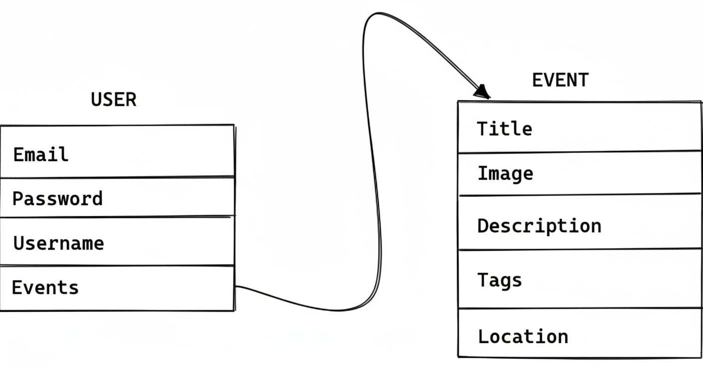

# 🏗️ **Structuring FastAPI Applications**

In the previous sections, we explored the fundamentals of creating a FastAPI application. The single-file to-do app we built demonstrated the remarkable flexibility and power of FastAPI, highlighting how easy it is to get started.

However, as applications grow in complexity and gain more features, a single-file structure becomes difficult to maintain. This is where the need for proper application structuring becomes essential.

**Structuring** refers to the arrangement of an application's components in an organized and modular format. This separation of concerns is vital for improving the readability of your code and content.

A well-structured application leads to:

  * 🚀 Faster development
  * 🐛 Quicker debugging
  * 📈 An overall increase in productivity

This section will equip you with the knowledge of what structuring is and how to effectively structure your API. We will cover structuring application routes and models, and implement the models for a new "planner" API.

-----

## 🏛️ Structuring in FastAPI Applications

For this section, we will begin building a new event planner application. We'll name the project `05-structuring-apps`.

Let's design our target application structure to look like this:

```plaintext
05-structuring-apps/
├── main.py
├── database/
│   ├── __init__.py
│   └── connection.py
├── routes/
│   ├── __init__.py
│   ├── events.py
│   └── users.py
└── models/
    ├── __init__.py
    ├── events.py
    └── users.py
```

### 1\. Create the Project Directory

The first step is to create a new folder for our application.

```bash
mkdir 05-structuring-apps && cd 05-structuring-apps
```

#### 📜 Command Explanation

  * **`mkdir 05-structuring-apps`**: This command creates a new directory named `05-structuring-apps`.
  * **`&&`**: This is a logical operator that chains commands. It means "if the first command was successful, then run the next command."
  * **`cd 05-structuring-apps`**: This command changes the current directory, moving you inside the newly created project folder.

-----

### 2\. Create the Entry File and Subfolders

Inside our new project directory, we will create the main entry file (`main.py`) and three subfolders to organize our code.

```bash
touch main.py
mkdir database routes models
```

#### 📜 Command Explanation

  * **`touch main.py`**: This command creates a new, empty file named `main.py`. This file will be the main entry point for our application.
  * **`mkdir database routes models`**: This command creates three new sub-directories simultaneously: `database`, `routes`, and `models`.

-----

### 3\. Initialize Folders as Python Packages

Next, we must create an `__init__.py` file in every folder we just made. This is a special file that tells Python to treat these directories as packages (modules), allowing us to import files from them.

```bash
touch {database,routes,models}/__init__.py
```

#### 📜 Command Explanation

  * **`touch ...`**: This command creates the empty `__init__.py` files.
  * **`{database,routes,models}/`**: This is a shell expansion. The command will run for each item inside the curly braces, effectively running:
      * `touch database/__init__.py`
      * `touch routes/__init__.py`
      * `touch models/__init__.py`

-----

### 4\. Set Up the Database Folder

In the `database` folder, let's create a file that will handle our database configurations and connection logic in the future.

```bash
touch database/connection.py
```

#### 📜 Command Explanation

  * This command creates a new, empty file named `connection.py` inside the `database` directory. This file will later contain all our database abstraction and configuration logic.

-----

### 5\. Create Feature-Specific Files

Finally, we'll create the files for our specific API features (events and users) inside both the `routes` and `models` folders.

```bash
touch {routes,models}/{events,users}.py
```

#### 📜 Command Explanation

  * This command uses shell expansion twice to create multiple files at once. It expands to:
      * `touch routes/events.py`
      * `touch routes/users.py`
      * `touch models/events.py`
      * `touch models/users.py`

-----

## 📦 Understanding the File Responsibilities

We have now successfully structured our API by grouping similar files according to their functions. Each file has a distinct purpose:

### 📁 `routes/`

Files in this folder will define the API endpoints (paths) for different features.

  * **`events.py`**: This file will handle all routing operations for events, such as creating, updating, and deleting them.
  * **`users.py`**: This file will handle all routing operations for users, such as registration and sign-in.

### 📁 `models/`

Files in this folder will contain the Pydantic model definitions (the data shapes) for our application.

  * **`events.py`**: This file will contain the Pydantic models required for event operations (e.g., `EventCreate`, `EventUpdate`).
  * **`users.py`**: This file will contain the Pydantic models required for user operations (e.g., `UserCreate`, `UserLogin`).

---

# 🚀 **Building an Event Planner Application**

In this section, we will build a complete event planner application. In this application, registered users will be able to create, update, and delete events. Events created can be viewed by navigating to the event page, which is created automatically by the application.

Each registered user and event will have a **unique ID**. This is to prevent conflicts when managing users and events that might share the same ID.

For this section, we will not be prioritizing **authentication** or **database management**, as those topics will be discussed in depth in later chapters.

-----

## 🔧 Environment Setup and Dependencies

To kick-start the development, let us create a virtual environment and activate it in our project directory.

### 1\. Create a Virtual Environment

```bash
python3 -m venv venv
```

  * This command uses the `python3` interpreter's built-in `venv` module to create a new virtual environment in a directory named `venv`.

### 2\. Activate the Virtual Environment

```bash
source venv/bin/activate
```

  * This command activates the new virtual environment. Your terminal prompt will usually change to show `` at the beginning.

### 3\. Install Application Dependencies

Next, let’s install the necessary packages for our application.

```bash
pip install fastapi uvicorn "pydantic[email]"
```

  * **`fastapi`**: This installs the main FastAPI framework.
  * **`uvicorn`**: This installs the Uvicorn ASGI server, which is needed to run our application.
  * **`"pydantic[email]"`**: This installs Pydantic along with optional dependencies required for email validation (`EmailStr`).

### 4\. Save Project Requirements

Lastly, let’s save the installed dependencies into a `requirements.txt` file.

```bash
pip freeze > requirements.txt
```

  * This command "freezes" all the currently installed packages in the environment and saves their exact versions to the `requirements.txt` file, making it easy to replicate this environment later.

Now that we have successfully installed our dependencies and set up our development environment, let’s implement the application’s models.

-----

## 🏗️ Implementing the Application Models

The first step in building our application is to define the models for the event and the user. The models describe how data will be stored, validated, and represented in our application.

<kbd>
<div align="center">
  
</div>
<kbd/>


### 1\. Model Flow Diagram

The following diagram (Figure 5.1) illustrates the modeling for both the user and event, as well as their relationship.

As shown in the model diagram, each **USER** model will have an `Events` field. This field will contain a list of the **EVENT** objects that the user has ownership of.

### 2\. Event Model Definition (`models/events.py`)

Let’s define the `Event` model in the `models/events.py` file. This model will include a `Config` subclass to provide example data for our API documentation.

```python
from pydantic import BaseModel
from typing import List

class Event(BaseModel):
    id: int
    title: str
    image: str
    description: str
    tags: List[str]
    location: str
    
    class Config:
        schema_extra = {
            "example": {
                "title": "FastAPI Book Launch",
                "image": "https://linktomyimage.com/image.png",
                "description": "We will be discussing the contents of the FastAPI book in this event. Ensure to come with your own copy to win gifts!",
                "tags": ["python", "fastapi", "book", "launch"],
                "location": "Google Meet"
            }
        }
```

#### Code Explanation 🧐

  * **`from pydantic import BaseModel`**: Imports the `BaseModel` class from Pydantic, which is the foundation for creating all data models.
  * **`from typing import List`**: Imports the `List` type hint, allowing us to define fields that are lists (arrays).
  * **`class Event(BaseModel):`**: Defines our new `Event` model, which inherits from `BaseModel`.
  * **`id: int`**: An integer field to store the event's unique ID.
  * **`title: str`**: A string field for the event's title.
  * **`image: str`**: A string field that will hold a link (URL) to the event's banner image.
  * **`description: str`**: A string field for the detailed description of the event.
  * **`tags: List[str]`**: A field that is a list of strings, used for grouping or categorizing events.
  * **`location: str`**: A string field for the location of the event (e.g., "Google Meet" or a physical address).
  * **`class Config:`**: A nested class used to provide configuration to the `Event` model.
  * **`schema_extra`**: This class variable allows us to provide a dictionary of custom data.
  * **`"example": { ... }`**: The key `"example"` is used by FastAPI's documentation. The provided dictionary will be shown as an example payload, guiding API users on what data to send.

### 3\. User Model Definition (`models/users.py`)

Now that we have our `Event` model, let’s define the `User` model.

```python
from pydantic import BaseModel, EmailStr
from typing import Optional, List
from models.events import Event

class User(BaseModel):
    email: EmailStr
    password: str
    events: Optional[List[Event]]

    class Config:
        schema_extra = {
            "example": {
                "email": "fastapi@packt.com",
                "username": "strong!!!",
                "events": [],
            }
        }
```

#### Code Explanation 🧐

  * **`from pydantic import BaseModel, EmailStr`**: Imports `EmailStr`, a special Pydantic type that validates if a string is a valid email address.
  * **`from typing import Optional, List`**: Imports `Optional`, which indicates that a field is not required (it can be `None`).
  * **`from models.events import Event`**: Imports our `Event` model, allowing us to create a nested relationship.
  * **`class User(BaseModel):`**: Defines our new `User` model.
  * **`email: EmailStr`**: The user's email address. Pydantic will automatically validate its format.
  * **`password: str`**: The user's password, stored as a string.
  * **`events: Optional[List[Event]]`**: This field defines the relationship. It is an optional list of `Event` models. It is empty by default.
  * **`class Config:`**: The nested configuration class for the `User` model.
  * **`schema_extra`**: Provides an example of user data for the API documentation.

### 4\. The `NewUser` Model (Data Type)

Next, we will create a new model named `NewUser` (not shown in code yet), which will inherit from the `User` model. This new model will be used specifically as the data type for the **user registration** endpoint.

The main `User` model will be used as a **response model** in situations where we do not want to interact with or expose the `password` field, reducing the amount of work to be done.

### 5\. User Sign-In Model (`models/users.py`)

Lastly, let’s implement a separate model that will be used exclusively for signing users in.

```python
class UserSignIn(BaseModel):
    email: EmailStr
    password: str

    class Config:
        schema_extra = {
            "example": {
                "email": "fastapi@packt.com",
                "password": "strong!!!",
            }
        }
```

#### Code Explanation 🧐

  * **`class UserSignIn(BaseModel):`**: Defines a new model specifically for the sign-in operation.
  * **`email: EmailStr`**: The email the user is using to sign in.
  * **`password: str`**: The password the user is providing.
  * **`class Config:`**: A nested configuration class for the `UserSignIn` model.
  * **`schema_extra`**: Provides an example payload for the sign-in endpoint in the API documentation.

Now that we have successfully implemented our models, we can proceed to build the routes that use them.


---