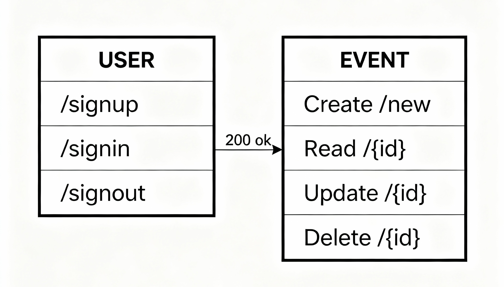

# 🏗️ **Structuring FastAPI Applications**

In the previous sections, we explored the fundamentals of creating a FastAPI application. The single-file to-do app we built demonstrated the remarkable flexibility and power of FastAPI, highlighting how easy it is to get started.

However, as applications grow in complexity and gain more features, a single-file structure becomes difficult to maintain. This is where the need for proper application structuring becomes essential.

**Structuring** refers to the arrangement of an application's components in an organized and modular format. This separation of concerns is vital for improving the readability of your code and content.

A well-structured application leads to:

  * 🚀 Faster development
  * 🐛 Quicker debugging
  * 📈 An overall increase in productivity

This section will equip you with the knowledge of what structuring is and how to effectively structure your API. We will cover structuring application routes and models, and implement the models for a new "planner" API.

-----

## 🏛️ Structuring in FastAPI Applications

For this section, we will begin building a new event planner application. We'll name the project `05-structuring-apps`.

Let's design our target application structure to look like this:

```plaintext
05-structuring-apps/
├── main.py
├── database/
│   ├── __init__.py
│   └── connection.py
├── routes/
│   ├── __init__.py
│   ├── events.py
│   └── users.py
└── models/
    ├── __init__.py
    ├── events.py
    └── users.py
```

### 1\. Create the Project Directory

The first step is to create a new folder for our application.

```bash
mkdir 05-structuring-apps && cd 05-structuring-apps
```

#### 📜 Command Explanation

  * **`mkdir 05-structuring-apps`**: This command creates a new directory named `05-structuring-apps`.
  * **`&&`**: This is a logical operator that chains commands. It means "if the first command was successful, then run the next command."
  * **`cd 05-structuring-apps`**: This command changes the current directory, moving you inside the newly created project folder.

-----

### 2\. Create the Entry File and Subfolders

Inside our new project directory, we will create the main entry file (`main.py`) and three subfolders to organize our code.

```bash
touch main.py
mkdir database routes models
```

#### 📜 Command Explanation

  * **`touch main.py`**: This command creates a new, empty file named `main.py`. This file will be the main entry point for our application.
  * **`mkdir database routes models`**: This command creates three new sub-directories simultaneously: `database`, `routes`, and `models`.

-----

### 3\. Initialize Folders as Python Packages

Next, we must create an `__init__.py` file in every folder we just made. This is a special file that tells Python to treat these directories as packages (modules), allowing us to import files from them.

```bash
touch {database,routes,models}/__init__.py
```

#### 📜 Command Explanation

  * **`touch ...`**: This command creates the empty `__init__.py` files.
  * **`{database,routes,models}/`**: This is a shell expansion. The command will run for each item inside the curly braces, effectively running:
      * `touch database/__init__.py`
      * `touch routes/__init__.py`
      * `touch models/__init__.py`

-----

### 4\. Set Up the Database Folder

In the `database` folder, let's create a file that will handle our database configurations and connection logic in the future.

```bash
touch database/connection.py
```

#### 📜 Command Explanation

  * This command creates a new, empty file named `connection.py` inside the `database` directory. This file will later contain all our database abstraction and configuration logic.

-----

### 5\. Create Feature-Specific Files

Finally, we'll create the files for our specific API features (events and users) inside both the `routes` and `models` folders.

```bash
touch {routes,models}/{events,users}.py
```

#### 📜 Command Explanation

  * This command uses shell expansion twice to create multiple files at once. It expands to:
      * `touch routes/events.py`
      * `touch routes/users.py`
      * `touch models/events.py`
      * `touch models/users.py`

-----

## 📦 Understanding the File Responsibilities

We have now successfully structured our API by grouping similar files according to their functions. Each file has a distinct purpose:

### 📁 `routes/`

Files in this folder will define the API endpoints (paths) for different features.

  * **`events.py`**: This file will handle all routing operations for events, such as creating, updating, and deleting them.
  * **`users.py`**: This file will handle all routing operations for users, such as registration and sign-in.

### 📁 `models/`

Files in this folder will contain the Pydantic model definitions (the data shapes) for our application.

  * **`events.py`**: This file will contain the Pydantic models required for event operations (e.g., `EventCreate`, `EventUpdate`).
  * **`users.py`**: This file will contain the Pydantic models required for user operations (e.g., `UserCreate`, `UserLogin`).

---

# 🚀 **Building an Event Planner Application**

In this section, we will build a complete event planner application. In this application, registered users will be able to create, update, and delete events. Events created can be viewed by navigating to the event page, which is created automatically by the application.

Each registered user and event will have a **unique ID**. This is to prevent conflicts when managing users and events that might share the same ID.

For this section, we will not be prioritizing **authentication** or **database management**, as those topics will be discussed in depth in later sections.

-----

## 🔧 Environment Setup and Dependencies

To kick-start the development, let us create a virtual environment and activate it in our project directory.

### 1\. Create a Virtual Environment

```bash
python3 -m venv venv
```

  * This command uses the `python3` interpreter's built-in `venv` module to create a new virtual environment in a directory named `venv`.

### 2\. Activate the Virtual Environment

```bash
source venv/bin/activate
```

  * This command activates the new virtual environment. Your terminal prompt will usually change to show `` at the beginning.

### 3\. Install Application Dependencies

Next, let’s install the necessary packages for our application.

```bash
pip install fastapi uvicorn "pydantic[email]"
```

  * **`fastapi`**: This installs the main FastAPI framework.
  * **`uvicorn`**: This installs the Uvicorn ASGI server, which is needed to run our application.
  * **`"pydantic[email]"`**: This installs Pydantic along with optional dependencies required for email validation (`EmailStr`).

### 4\. Save Project Requirements

Lastly, let’s save the installed dependencies into a `requirements.txt` file.

```bash
pip freeze > requirements.txt
```

  * This command "freezes" all the currently installed packages in the environment and saves their exact versions to the `requirements.txt` file, making it easy to replicate this environment later.

Now that we have successfully installed our dependencies and set up our development environment, let’s implement the application’s models.

-----

## 🏗️ Implementing the Application Models

The first step in building our application is to define the models for the event and the user. The models describe how data will be stored, validated, and represented in our application.

<kbd>  </kbd>

# 📈 Model Definitions and Relationships

Here is the updated documentation reflecting the modern Pydantic V2 syntax, which uses `ConfigDict` instead of the old `class Config`.

-----

### 1\. Model Flow Diagram

The following diagram (Figure 5.1) illustrates the modeling for both the user and event, as well as their relationship.

As shown in the model diagram, each **USER** model will have an `Events` field. This field will contain a list of the **EVENT** objects that the user has ownership of.

-----

### 2\. Event Model Definition (`models/events.py`)

Let’s define the `Event` model in the `models/events.py` file. This model will use `model_config` and `ConfigDict` to provide example data for our API documentation.

```python
from pydantic import BaseModel, ConfigDict
from typing import List

class Event(BaseModel):
    id: int
    title: str
    image: str
    description: str
    tags: List[str]
    location: str
    
    # This is the updated Pydantic V2 configuration
    model_config = ConfigDict(
        json_schema_extra = {
            "example": {
                "title": "FastAPI Book Launch",
                "image": "https://linktomyimage.com/image.png",
                "description": "We will be discussing the contents of the FastAPI book in this event. Ensure to come with your own copy to win gifts!",
                "tags": ["python", "fastapi", "book", "launch"],
                "location": "Google Meet"
            }
        }
    )
```

#### Code Explanation 🧐

  * **`from pydantic import BaseModel, ConfigDict`**: Imports the `BaseModel` class (the foundation for models) and `ConfigDict` (the object used for model configuration).
  * **`from typing import List`**: Imports the `List` type hint, allowing us to define fields that are lists (arrays).
  * **`class Event(BaseModel):`**: Defines our new `Event` model, which inherits from `BaseModel`.
  * **`id: int`**: An integer field to store the event's unique ID.
  * **`title: str`**: A string field for the event's title.
  * **`image: str`**: A string field that will hold a link (URL) to the event's banner image.
  * **`description: str`**: A string field for the detailed description of the event.
  * **`tags: List[str]`**: A field that is a list of strings, used for grouping or categorizing events.
  * **`location: str`**: A string field for the location of the event (e.g., "Google Meet" or a physical address).
  * **`model_config = ConfigDict(...)`**: This class variable (named `model_config`) is assigned a `ConfigDict` object to provide configuration to the `Event` model. This replaces the old `class Config`.
  * **`json_schema_extra`**: This key *inside* the `ConfigDict` allows us to provide a dictionary of custom data.
  * **`"example": { ... }`**: The key `"example"` is used by FastAPI's documentation. The provided dictionary will be shown as an example payload, guiding API users on what data to send.

-----

### 3\. User Model Definition (`models/users.py`)

Now that we have our `Event` model, let’s define the `User` model, also updated with `ConfigDict`.

```python
from pydantic import BaseModel, EmailStr, ConfigDict
from typing import Optional, List
from models.events import Event

class User(BaseModel):
    email: EmailStr
    password: str
    events: Optional[List[Event]] = None # Added default None

    # This is the updated Pydantic V2 configuration
    model_config = ConfigDict(
        json_schema_extra = {
            "example": {
                "email": "fastapi@packt.com",
                "password": "strong!!!", # Corrected from "username"
                "events": [],
            }
        }
    )
```

#### Code Explanation 🧐

  * **`from pydantic import BaseModel, EmailStr, ConfigDict`**: Imports `BaseModel`, `EmailStr` (a special Pydantic type for email validation), and `ConfigDict` (for configuration).
  * **`from typing import Optional, List`**: Imports `Optional`, which indicates that a field is not required (it can be `None`).
  * **`from models.events import Event`**: Imports our `Event` model, allowing us to create a nested relationship.
  * **`class User(BaseModel):`**: Defines our new `User` model.
  * **`email: EmailStr`**: The user's email address. Pydantic will automatically validate its format.
  * **`password: str`**: The user's password, stored as a string.
  * **`events: Optional[List[Event]] = None`**: This field defines the relationship. It is an optional list of `Event` models. It defaults to `None`.
  * **`model_config = ConfigDict(...)`**: This class variable is assigned a `ConfigDict` object to configure the `User` model, replacing the old `class Config`.
  * **`json_schema_extra`**: A key within `ConfigDict` that provides an example of user data for the API documentation. (Note: The example's `"username"` field was corrected to `"password"` to match the model definition).

### 4\. The `NewUser` Model (Data Type)

Next, we will create a new model named `NewUser` (not shown in code yet), which will inherit from the `User` model. This new model will be used specifically as the data type for the **user registration** endpoint.

The main `User` model will be used as a **response model** in situations where we do not want to interact with or expose the `password` field, reducing the amount of work to be done.

### 5\. User Sign-In Model (`models/users.py`)

Lastly, let’s implement a separate model that will be used exclusively for signing users in.

```python
class UserSignIn(BaseModel):
    email: EmailStr
    password: str

    class Config:
        json_schema_extra = {
            "example": {
                "email": "fastapi@packt.com",
                "password": "strong!!!",
            }
        }
```

#### Code Explanation 🧐

  * **`class UserSignIn(BaseModel):`**: Defines a new model specifically for the sign-in operation.
  * **`email: EmailStr`**: The email the user is using to sign in.
  * **`password: str`**: The password the user is providing.
  * **`class Config:`**: A nested configuration class for the `UserSignIn` model.
  * **`json_schema_extra`**: Provides an example payload for the sign-in endpoint in the API documentation.

Now that we have successfully implemented our models, we can proceed to build the routes that use them.


---

# 🚀 **Blueprint for Interaction: Implementing API Routes**

The next step in building our application is to set up its routing system. We will be designing the API routes for both **events** and **users**.

The user routes will consist of endpoints for sign-up, sign-in, and sign-out. Access to the event routes will be controlled:

  * **Authenticated users** will have access to create, update, and delete events.
  * **The public** will be able to view events that have been created.

<div align="center">
  
</div>

The following diagram (Figure 5.2) illustrates the relationship and structure of these routes.

-----

## 🚪 User Routes (`routes/users.py`)

Now that we have a clear idea of which routes to implement from Figure 5.2, we will begin by defining the user-related routes in our `routes/users.py` file.

### 1\. Defining the Basic Sign-Up Route

First, let's create the endpoint for new users to register.

```python
from fastapi import APIRouter, HTTPException, status
from models.users import User, UserSignIn

user_router = APIRouter(
    tags=["User"],
)

users = {}

@user_router.post("/signup")
async def sign_user_up(data: User) -> dict:
    if data.email in users:
        raise HTTPException(
            status_code=status.HTTP_409_CONFLICT,
            detail="User with supplied username exists"
        )
    
    users[data.email] = data
    
    return {
        "message": "User successfully registered!"
    }
```

#### Code Explanation 🧐

  * **`from fastapi ...`**: We import `APIRouter` to create a new router, `HTTPException` to return error responses, and `status` for convenient access to standard HTTP status codes.
  * **`from models.users ...`**: We import our `User` and `UserSignIn` Pydantic models.
  * **`user_router = APIRouter(...)`**: We create a new router instance. The `tags=["User"]` argument is for documentation purposes; it will group all routes on this router under the "User" tag in the API docs.
  * **`users = {}`**: For now, we are using a simple Python dictionary as an in-memory "database." The keys will be user emails and the values will be the `User` objects. This will be replaced with a real database in section 6.
  * **`@user_router.post("/signup")`**: This decorator registers the function below to handle `POST` requests to the `/signup` path.
  * **`async def sign_user_up(data: User) -> dict:`**: This is our route handler function.
      * `data: User`: FastAPI will validate the incoming request body to ensure it matches the structure of our `User` model.
      * `-> dict`: This indicates that the function will return a Python dictionary (which FastAPI will convert to JSON).
  * **`if data.email in users:`**: This is our first business logic check. We see if a user with the provided email already exists in our `users` dictionary.
  * **`raise HTTPException(...)`**: If the user already exists, we stop execution and immediately send an error response to the client.
      * `status_code=status.HTTP_409_CONFLICT`: This sets the HTTP status to 409, indicating a conflict with the current state of the server (a duplicate user).
      * `detail=...`: This provides the error message in the JSON response body.
  * **`users[data.email] = data`**: If the user is new, we add them to our `users` dictionary.
  * **`return { ... }`**: We return a successful JSON response with a status code of 200 OK (the default for `POST`).

-----

### 2\. Implementing the Sign-In Route

Next, let’s implement the endpoint for existing users to sign in.

```python
@user_router.post("/signin")
async def sign_user_in(user: UserSignIn) -> dict:
    if user.email not in users:
        raise HTTPException(
            status_code=status.HTTP_404_NOT_FOUND,
            detail="User does not exist"
        )
    
    if users[user.email].password != user.password:
        raise HTTPException(
            status_code=status.HTTP_403_FORBIDDEN,
            detail="Wrong credential passed"
        )
    
    return {
        "message": "User signed in successfully"
    }
```

#### Code Explanation 🧐

  * **`@user_router.post("/signin")`**: We register this function to handle `POST` requests to `/signin`.
  * **`async def sign_user_in(user: UserSignIn) -> dict:`**: The function handler.
      * `user: UserSignIn`: Note that this endpoint uses the `UserSignIn` model. This model only includes `email` and `password`, which is exactly what we need for logging in.
  * **`if user.email not in users:`**: The first step is to check if the user even exists in our database.
  * **`raise HTTPException(...)`**: If the user's email is not found, we raise a `404 NOT_FOUND` error.
  * **`if users[user.email].password != user.password:`**: If the user *does* exist, we proceed to check their password. We retrieve the stored user data using `users[user.email]` and compare its `password` attribute to the `password` provided in the request body.
  * **`raise HTTPException(...)`**: If the passwords do not match, we raise a `403 FORBIDDEN` error, indicating the client is not authorized.
  * **`return { ... }`**: If both checks pass (the user exists and the password is correct), we return a success message.

-----

## 🚨 A Critical Security Warning

In our current routes, we are storing and checking passwords in **plain text**. This is done **only for demonstration purposes** and is a **very wrong and insecure practice** in software engineering in general.

Passwords should **never** be stored directly. We will discuss proper storage mechanisms, such as encryption and hashing, in later section, when our application moves from an in-memory dictionary to a real database.


---

# 🚀 **Activating the User Routes in `main.py`**

With our user routes defined in `routes/users.py`, it's time to bring our application to life. We will register these routes in our main entry point, `main.py`, and launch the application.

-----

### 1\. Update `main.py` with Imports

First, we need to import the necessary libraries and our newly created user router into the `main.py` file.

```python
from fastapi import FastAPI
from routes.user import user_router
import uvicorn
```

#### Code Explanation 🧐

  * **`from fastapi import FastAPI`**: This imports the main `FastAPI` class, which is the core of our web application.
  * **`from routes.user import user_router`**: This imports the `user_router` object we defined in our `routes/users.py` file. This router contains all our user-related endpoints (like `/signup` and `/signin`).
  * **`import uvicorn`**: This imports `uvicorn`, the ASGI (Asynchronous Server Gateway Interface) server that will run our application.

-----

### 2\. Create FastAPI Instance and Register Routes

Next, we create an instance of the `FastAPI` class and "include" our user routes within it.

```python
app = FastAPI()

# Register routes
app.include_router(user_router, prefix="/user")
```

#### Code Explanation 🧐

  * **`app = FastAPI()`**: This line creates the main application instance, which we have named `app`.
  * **`app.include_router(user_router, prefix="/user")`**: This is a key step. It tells the main `app` to include all the routes defined in `user_router`.
  * **`prefix="/user"`**: This powerful argument adds a URL prefix to every route in `user_router`. This means:
      * The `/signup` route from `user_router` will now be accessible at `/user/signup`.
      * The `/signin` route from `user_router` will now be accessible at `/user/signin`.
        This helps organize our API endpoints by feature.

-----

### 3\. Add the Uvicorn Entry Point

To make our `main.py` file runnable as a script, we add the standard Python entry point.

```python
if __name__ == "__main__":
    uvicorn.run("main:app", host="0.0.0.0", port=8080, reload=True)
```

#### Code Explanation 🧐

  * **`if __name__ == "__main__":`**: This is a standard Python condition. The code inside this block will *only* run when you execute the `main.py` file directly (e.g., `python main.py`), not when it's imported by another file.
  * **`uvicorn.run(...)`**: This is the command that starts the web server.
  * **`"main:app"`**: This tells Uvicorn where to find our application. It means "look inside the file named `main.py` for the variable named `app`."
  * **`host="0.0.0.0"`**: This setting makes the server accessible from any device on your network, not just from your local machine.
  * **`port=8080`**: This specifies that the application will run on port `8080`.
  * **`reload=True`**: This enables "hot reloading." The server will automatically restart every time you save a change in your code, which is extremely useful during development.

-----

### 4\. Run the Application 🖥️

Now, let's start the application from the terminal:

```bash
python main.py
```

You will see console output confirming the server is running and watching for code changes:

```console
INFO:     Will watch for changes in these directories: ['C:\\Users\\Hashim\\Desktop\\resources\\fastapi-api\\05-structuring-apps']
INFO:     Uvicorn running on http://0.0.0.0:8080 (Press CTRL+C to quit)
INFO:     Started reloader process [5672] using WatchFiles
INFO:     Started server process [14360]
INFO:     Waiting for application startup.
INFO:     Application startup complete.
```

-----

### 5\. Test the Endpoints 🧪

With our application running, we can test the user routes we implemented using `curl`.

#### A. Test User Sign-Up (Success)

We'll send a `POST` request to the `/user/signup` endpoint to create a new user.

```bash
curl -X POST http://127.0.0.1:8080/user/signup -H "Content-Type: application/json" -d '{"email": "hashiimtahir@gmail.com", "password": "Pakistan1234-", "username": "hashimtahir"}'
```

This request returns a successful response, indicating the user was registered:

```json
{
 "message": "User successfully registered!"
}
```

#### B. Test User Sign-In (Success)

The successful response confirms the operation. Now, let’s test the `/user/signin` route with the correct credentials.

```bash
curl -X POST 'http://127.0.0.1:8080/user/signin' -H 'accept: application/json' -H 'Content-Type: application/json' -d '{"email": "hashiimtahir@gmail.com", "password": "Pakistan1234-"}'
```

The response to this request is as follows:

```json
{
 "message": "User signed in successfully"
}
```

#### C. Test User Sign-In (Failure)

If we pass an incorrect password, our application should return the `HTTPException` detail message we defined.

```bash
curl -X POST 'http://127.0.0.1:8080/user/signin' -H 'accept: application/json' -H 'Content-Type: application/json' -d '{"email": "fastapi@packt.com", "password": "password!"}'
```

The response from this failed request is as follows:

```json
{
 "detail": "Wrong credential passed"
}
```

-----

### 6\. Explore the Interactive API Documentation 📚

We can also view and interact with our routes from the automatic, interactive documentation provided by FastAPI (which is powered by Swagger UI).

Visit **`http://127.0.0.1:8080/docs`** in your browser to access this documentation.

Now that we have successfully implemented the user routes, we can move on to the next part of our application.


---